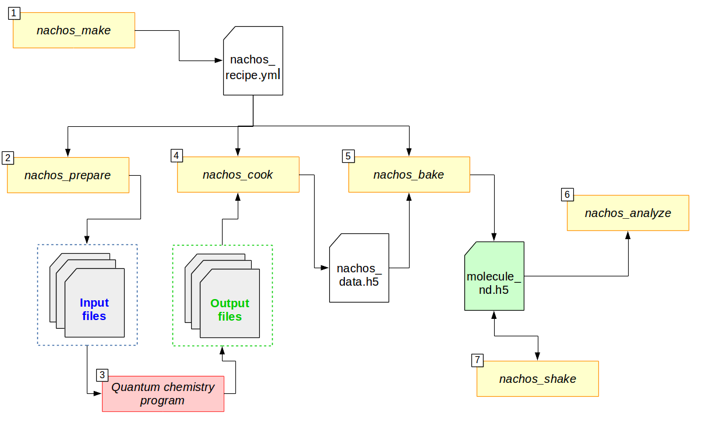

=================
How to use nachos
=================

Concepts
--------

+  The numerical differentiation is used to obtain (static) derivatives to different quantities.
   It exploits the following identity, given :math:`f(x)` a given function expanded in Taylor series,

   .. math::

      \left.\frac{\partial f(x)}{\partial x}\right|_{x=0} = \lim_{h_0\rightarrow 0} \underbrace{\frac{f(h_0)-f(0)}{h_0}}_{\text{forward derivative}} = \lim_{h_0\rightarrow 0} \underbrace{\frac{f(h_0)-f(-h_0)}{2\,h_0}}_{\text{centered derivative}},

   where :math:`h_0` is the minimal field (``min_field`` parameter).

+  The code use the Romberg procedure to remove contamination from higher orders (see `this publication <dx.doi.org/10.1002/qua.24685>`_ for more details).
   The derivative is computed for different values of :math:`h=a^k\,h_0`, with :math:`k<k_{max}` the field amplitude (which lead to the ``k_max`` parameter), and :math:`a` is the common ratio (``ratio`` parameter).
   The procedure goes as follow:

   .. math::

      \begin{align}
      &H_{k,0} = \frac{f(a^kh_0)-f(-a^kh_0)}{2\,a^kh_0},\\
      &H_{k,m+1} = \frac{a^{2m}\,H_{k,m}-H_{k+1,m}}{a^{2m}-1},
      \end{align}

   where :math:`m` is the number of iterations (or refinement steps).
   This leads to a so-called *Romberg triangle*, from which the value of the derivative is extracted.

+  The different quantities are written **as derivatives with respect to the energy**.
   For example, the geometric Hessian, second order of the energy with respect to geometrical derivatives, is written ``GG``, ``G`` meaning *geometrical derivative with respect to cartesian coordinates*.
   Accordingly,

   + ``F`` means *derivatives with respect to static electric field* ;
   + ``D`` means *derivatives with respect to dynamic electric field* (with a given frequency), ``d`` means the same, but with inverse frequency (:math:`-\omega`) and ``X`` means any multiple (:math:`\pm i\omega`) ;
   + ``N`` means *derivatives with respect to normal coordinates*.

   Therefore, the static hyperpolarizability, :math:`\beta(0;0,0)`, is written ``FFF``, while the dynamic hyperpolarizability depends on the process involved: ``dDF`` for EOP  [:math:`\beta(-\omega;\omega,0)`] and ``XDD`` for SHG [:math:`\beta(-2\omega;\omega,\omega)`].
   See the list `below <#list-of-the-derivatives>`_.

   Geometrical derivatives of an electrical derivative are written with the geometrical derivatives **first**.
   For example, the first order geometrical derivative (with respect to normal mode) of the static polarizability, :math:`\frac{\partial \alpha}{\partial Q}`, is written ``NFF``, the second order one ``NNFF``.

   Note that the number of ``G`` and ``N`` thus correspond to the level of geometric differentiation and the number of ``F``, ``D`` and ``d`` to the level of electrical differentiation.

+  Nachos is abble to perform differentiation with respect to static electric field (``F``) and cartesian coordinate (``G``).
   Given the cartesian hessian, ``nachos_bake`` (see below) perform a vibrational analysis and is able to project ``G`` derivatives over normal mode, giving the corresponding ``N`` ones.

+ Nachos (because of the underlying library, `qcip_tools <https://gitlab.unamur.be/pierre.beaujean/qcip_tools>`_) takes advantage of permutation symmetry and `Shwarz's theorem <https://en.wikipedia.org/wiki/Symmetry_of_second_derivatives#Schwarz.27s_theorem>`_ (referred as "Kleinman symmetry" in the field of nonlinear optics).

General workflow
----------------

Here is the schematic of the workflow with the nachos package:

   Flowchart for the different parts of the nachos package. Arrows indicate whether a part is an input (arrows going in) of a program (rectangle) or an output (arrow going out).

In short,

1. `nachos_make <#id1>`_ creates a *recipe* (``nachos_recipe.yml``, but you can change that), which is the file that explains what to do and how to do it ;
2. `nachos_prepare <#id2>`_ uses the recipe to generate the different input files for the quantum chemistry program of your choice (currently Gaussian and Dalton) ;
3. The quantum chemistry program process the different input files and generate output files ;
4. `nachos_cook <#id3>`_ carry out all the information that it can get from output files (FCHK files for gaussian, TAR archives and OUT files for Dalton) and store them in a *data file* (``nachos_data.h5``, but you can change that) ;
5. `nachos_bake <#id4>`_ perform the requested numerical differentiation(s) out of the data from the *data file*, and store them in a *final file* (``molecule_nd.h5``, but you can change that) ;
6. (*optional*) `nachos_analyze <#id6>`_ allow to quickly get a given property for each quantity stored in the *final file* (e.g. a tensor component, an average, ...) ;
7. (*optional*) if possible, `nachos_shake <#id5>`_ will add the different vibrational contribution to the electrical derivatives of the energy.

Therefore, it should looks like:

.. sourcecode:: bash

    # create subdirectory:
    mkdir new_directory
    cd new_directory

    # create recipe and inputs:
    nachos_make && nachos_prepare

    # ... run all the inputs ...

    # carry out and perform numerical differentiation:
    nachos_cook && nachos_bake # or nachos_bake -P

    # ... eventually, add vibrational contributions:
    nachos_shake

    # ... eventually, post-analyze:
    nachos_analyze -p "xxxx" > nachos.log

See below for more details on every command.

.. autoprogram:: nachos.make:get_arguments_parser()
    :prog: nachos_make

.. note::

    + It is easier to place the geometry file (and eventual basis set and other extra files) in the **same** directory as the recipe.
    + For some terminal, it is not possible to use the extended prompt toolkit, use ``-N`` to get an alternative.
    + Default behavior is if there is an error in the input argument, the corresponding question is asked again.
      If you just want the program to fail (because you are using it in a script), use the ``-S`` option.
    + ``F`` differentiation is **only possible** with gaussian.

The program prompts for different information in order to create a *recipe file*, if not given in command line, and generate a recipe in output (``-o`` option, default is ``nachos_recipe.yml``).

.. list-table::
   :header-rows: 1
   :widths: 20 35 35 10

   * - Option
     - Question
     - Possible inputs
     - Note
   * - ``--flavor``
     - "What flavor for you, today?"
     - ``gaussian`` | ``dalton``
     -
   * - ``--type``
     - "What type of differentiation?"
     - ``F`` | ``G``
     -
   * - ``--method``
     - "With which method?"
     - :ref:`see below <nachos_make_note_1>`
     -
   * - ``--XC``
     - "Which XC functionnal?"
     - *XC functional*
     - Only if ``DFT``
   * - ``--CC``
     - "Which Coupled Cluster method?"
     - ``CCS`` | ``CC2`` | ``CCSD`` | ``CC3``
     - Only if ``CC`` (and dalton)
   * - ``--geometry``
     - "Where is the geometry? "
     - *path to a .com/.xyz/.fchk/.mol* file
     -
   * - ``--basis-set``
     - "With which basis set?"
     - *valid basis set* | ``gen``
     -
   * - ``--gen-basis``
     - "Where is the gen basis set?"
     - *path to a gbs file*
     - Only if ``gaussian`` and ``gen``
   * - ``--differentiation``
     - "What to differentiate?"
     - :ref:`see below <nachos_make_note_2>`
     -
   * - ``--frequencies``
     - "Dynamic frequencies?"
     - :ref:`see below <nachos_make_note_3>`
     - Only if dynamic quantities requested
   * - ``--name``
     - "Name of the files?"
     - *any string*
     - Avoid spaces and special characters!
   * - ``--min-field``
     - "Minimum field (F0)?"
     - *floating number*
     -
   * - ``--ratio``
     - "Ratio (a)?"
     - *floating number*
     -
   * - ``--k-max``
     - "Maximum k?"
     - *floating number*
     -
   * - ``--flavor-extra``
     - "Update flavor extra ?"
     - :ref:`see below <nachos_make_note_4>`
     - Blank input use default values

When everything is done, you end up with a ``.yml`` file that contains all the information you input.
For example, this is an input to compute vibrational contribution to the polariability:

.. code-block:: yaml

    # flavor
    flavor: gaussian
    method: HF
    basis_set: gen
    geometry: water.xyz
    flavor_extra:
      convergence: 11
      cphf_convergence: 10
      gen_basis: sto-3g.gbs
      memory: 3Gb
      procs: 4
    # differentiation (the label is the number of time
    # you want to differentiate each item of the list)
    differentiation:
      2:
        - F
        - FF
        - dD
      1:
        - GG
    type: G
    min_field: 0.01
    ratio: 2
    k_max: 3
    frequencies:
      - 1064nm
      - 694.3nm
    # others:
    name: water_test

Obviously, nothing prevents you from writing your own *recipe file* from scratch. Actually, you just need to define

    + ``flavor`` ;
    + ``type`` ;
    + ``method`` ;
    + ``basis_set`` ;
    + ``geometry`` ;
    + ``differentiation`` ;

Since there is default values for the rest.

-------

.. _nachos_make_note_1:

For ``--method``: the value of this argument depends on the *flavor* you chose.
This also determine the maximum properties available at this level i.e. what you can request in ``--differentiation`` (:ref:`see below <nachos_make_note_2>`).

+ For ``gaussian`` (chosen according to the `force page <http://gaussian.com/force/>`_, the `freq page <http://gaussian.com/freq/>`_ and the `polar page <http://gaussian.com/polar/>`_):

  .. list-table::
       :header-rows: 1
       :widths: 30 20 20 30

       * - Method
         - Maximum level of electrical properties
         - Maximum level of geometrical properties
         - Available
       * - ``HF``
         - 3
         - 2
         - ``energy``, ``G``, ``GG``, ``F``, ``FF``, ``dD``, ``dDF``, ``XDD``
       * - ``DFT``
         - 3
         - 2
         - ``energy``, ``G``, ``GG``, ``F``, ``FF``, ``dD``, ``dDF``, ``XDD``
       * - ``MP2``
         - 2
         - 2
         - ``energy``, ``G``, ``GG``, ``F``, ``FF``
       * - ``MP3``, ``MP4``, ``MP4D``, ``MP4DQ``, ``MP4SDQ``
         - 1
         - 1
         - ``energy``, ``G``, ``F``
       * - ``CCSD``
         - 1
         - 1
         - ``energy``, ``G``, ``F``
       * - ``CCSD(T)``
         - 0
         - 0
         - ``energy``

  Some method are not available, but may be added in the future if needed (CI methods, for example).

+ For ``dalton``:

  .. list-table::
       :header-rows: 1
       :widths: 30 20 20 30

       * - Method
         - Maximum level of electrical properties
         - Maximum level of geometrical properties
         - Available
       * - ``HF``
         - 4
         - 2
         - ``energy``, ``G``, ``GG``, ``F``, ``FF``, ``dD``, ``dDF``, ``XDD``, ``FFFF``, ``dDFF``, ``XDDF``, ``dDDd``, ``XDDD``
       * - ``DFT``
         - 4
         - 2
         - ``energy``, ``G``, ``GG``, ``F``, ``FF``, ``dD``, ``dDF``, ``XDD``, ``FFFF``, ``dDFF``, ``XDDF``, ``dDDd``, ``XDDD``
       * - ``CC``
         - 4
         - 1
         - ``energy``, ``G``, ``F``, ``FF``, ``dD``, ``dDF``, ``XDD``, ``FFFF``, ``dFFD``, ``XDDF``, ``dDDd``, ``XDDD``

  Note that for the ``DFT`` method, only a few XC functional allow to compute more than the polarizability (this list may not be accurate, and it is not checked by the program):

  + B1LYP
  + B2PLYP
  + B3LYP
  + B86x
  + Becke
  + BHandH
  + BHandHLYP
  + BLYP
  + BVWN
  + Camb3lyp
  + KMLYP
  + LDA
  + LYP
  + pbex
  + Slater
  + SVWN5
  + WL90c
  + XAlpha

.. warning::

    + Due to some differences in the implementation, dc-Kerr effect is ``dDFF`` with HF and DFT (*RESPONSE* module), while it is ``dFFD`` with CC.
      Use the correct one.
    + By default, first and (some components of the) second hyperpolarizability with HF or DFT are printed with an lower accuracy than the other responses.
      If you want a better accuracy, consider `patching Dalton <./install.html>`_.

-------

.. _nachos_make_note_2:

For ``--differentiation``: this is where you request what you want to differentiate, and up to which level, with a semicolon separated list.
Each member of the list should be of the form ``what:how many``, where ``what`` is a properties (`see the appendix <#list-of-derivatives>`_) and ``how much`` is how many times you want to differentiate this property.

For example,

+ If you want to do an electric field differentiation (``F``) to obtain the static first hyperpolarizability (``FFF``) from the energy, input should be ``energy:3``, because you want to differentiate energy 3 times.
  To get the same property from the dipole moment and the static polarizability, the input is ``F:2;FF:1``.
+ If you want to get the vibrational contribution to a given property (say, the polarizability), you need to select ``G`` for the type of differentiation, then you need at least second order derivative of the dipole moment polariability with respect to that (the first one is automatically computed if the second is), and the cubic force field, so an input could look like ``FF:2;F:2;GG:1`` (and eventually ``dD:2``).

:ref:`See above <nachos_make_note_1>` for the list of properties that you can differentiate depending on the *flavor* and the method.

-------

.. _nachos_make_note_3:

For ``--frequencies``: This is only relevant if you requested the differentation of a quantity that is dynamic.
The input is a list of semicolon separated frequencies, and is quite liberal, since a valid example could be ``1064nm;0.04:1000cm-1;0.1eV`` (it accepts ``eV``, ``cm-1``,  ``nm`` and nothing, which means atomic units).
The values are converted in atomic unit in ``nachos_prepare`` (see below).

-------

.. _nachos_make_note_4:

For ``--flavor-extra``: this option actually controls the generation of input files and that is it (for example, that is where you request the amount of memory and processors for gaussian).
The options depends on the *flavor*, and are given in a semicolon separated list (for example ``procs=4;memory=3Gb;extra_keywords=srcf=(iefpcm,solvent=water)`` for ``gaussian``).
Note that you don't have to redefine every variable, since they have a default value which is correct for most cases.

+ For ``gaussian``, the options are

  .. list-table::
       :header-rows: 1
       :widths: 20 20 60

       * - Option
         - Default value
         - Note
       * - ``memory``
         - ``1Gb``
         - Value of ``%mem``
       * - ``procs``
         - ``1``
         - Value of ``%nprocshared``
       * - ``convergence``
         - ``11``
         - SCF convergence criterion
       * - ``cphf_convergence``
         - ``10``
         - CPHF convergence criterion
       * - ``cc_convergence``
         - ``11``
         - CC convergence criterion
       * - ``max_cycle``
         - ``600``
         - Maximum number of SCF and CC cycles
       * - ``extra_keywords``
         -
         - Any extra input (for example, the solvent, ...)
       * - ``extra_section``
         -
         - Path to a file where extra section of the input files are given (for example, solvent definition, ...)
       * - ``vshift``
         - ``1000``
         - Apply a *vshift* (helps for the electric field differentiation)

  Note that the value of ``extra_section`` is not tested here.
  Also, ``XC`` and ``gen_basis`` are available, but that would modify their previous values.

+ For ``dalton``, the options are

  .. list-table::
       :header-rows: 1
       :widths: 20 20 60

       * - Option
         - Default value
         - Note
       * - ``threshold``
         - ``1e-11``
         - Convergence criterion for the SCF gradient
       * - ``cc_threshold``
         - ``1e-11``
         - Convergence criterion for the CC energy gradient
       * - ``dal_name``
         - ``ND``
         - Prefix for the different ``.dal`` files
       * - ``response_threshold``
         - ``1e-10``
         - Convergence criterion for response functions
       * - ``response_max_it``
         - ``2500``
         - Maximum number of iteration to solve linear equations for response functions
       * - ``response_max_ito``
         - ``10``
         - Maximum number of trial vector microiterations (not relevant for CC)
       * - ``response_dim_reduced_space``
         - ``2500``
         - Maximum dimension of the reduced space (should be increased if large number of frequency or sharp convergence criterion).
       * - ``split_level_3``
         - ``1``
         - Split first hyperpolarizability calculations over separate dal files
       * - ``split_level_4``
         - ``1``
         - Split second hyperpolarizability calculations over separate dal files
       * - ``merge_level_3``
         - ``0``
         - Merge first hyperpolarizability calculations with lower order calculations (only for ``CC``). Priority over splitting.
       * - ``merge_level_4``
         - ``0``
         - Merge second hyperpolarizability calculations with lower order calculations (only for ``CC``). Priority over splitting.

  Note that the value of ``extra_section`` is not tested here.
  Also, ``XC`` and ``CC`` are available, but that would modify their previous values.

  Splitting and merging modify the number of calculation, but also the times it takes (because Dalton tries to solve all response functions at the same time, therefore you may need to increase ``response_max_it``).

.. autoprogram:: nachos.prepare:get_arguments_parser()
    :prog: nachos_prepare

The program will prepare as many input files as needed.
By using ``-d``, you can decide where the input files should be generated, but keep in mind that they should be in the same directory as the recipe for the next step (use ``-c`` if needed).

The ``-V 1`` option allows you to know how much files where generated.

.. note::

    To helps the dalton program, a file called ``inputs_matching.txt`` is created for this *flavor*, where each lines contains the combination of dal and mol file to launch (because there may be different dal files).

    If you use job arrays, you may therefor use a job file that contains the following lines (here with  `slurm <https://slurm.schedmd.com/>`_, but it is the same with other schedulers):

    .. code-block:: bash

      # get the files from the line:
      INPUT_FILES=$(sed -n "${SLURM_ARRAY_TASK_ID}p" inputs_matching.txt)
      # launch dalton:
      dalton $INPUT_FILES

    You need to launch as many calculations as there is lines in this file.

    For the gaussian program, just run as many calculation as there is input files, all are useful.

    Note that the program tries to optimize things as much as possible and request the computation of things that are needed at a given level (no need to do a gradient calculation for second order if not requested, for example, which explains the multiple dal files, and why some calculations may be faster than other).

.. autoprogram:: nachos.cook:get_arguments_parser()
    :prog: nachos_cook

The program fetch the different computational results from each files that it can fin (it looks for FCHK files with gaussian, TAR archive and OUT files for dalton), and mix them together in a single *data file*.

The ``-V 1`` option allows you to know which files the program actually discovered and used.

.. warning::

    The program looks for output files **in the same directory as the recipe**, and there is no way to change this behavior.

.. autoprogram:: nachos.bake:get_arguments_parser()
    :prog: nachos_bake

The ``-O`` option to control what is actually differentiated.
It expects a semicolon list like the ``--differentiation`` option of ``nachos_make`` (:ref:`see above <nachos_make_note_2>`), but you don't have to provide the number of time if you want the number in the recipe to be used.

So, for example, if you have a recipe that contains:

.. code-block:: yaml

    type: G
    # ... other stuffs ...
    differentiation:
      2:
        - F
        - FF
        - FD
      1:
        - GG

Using ``-O "F:1;FF:1"`` will request to peform the first order geometrical derivatives **only** for the dipole moment and static polarizability, while ``-O "F;FF:1"`` will request the same for static hyperpolarizability, but adds the second order for the dipole moment (as written in the recipe).
In both cases, dynamic polarizability is not differentiated.

The output depends on the value of ``-V``, which can be:

- ``-V 0`` nothing is outputted (this is default) ;
- ``-V 1`` outputs the final tensors that are obtained ;
- ``-V 2`` also outputs Romberg triangle and best values (for each nonredudant components) ;
- ``-V 3`` also output the decision process to find best value in Romberg triangle.

.. note::

    + If you request second order (or third, or ...) derivative, the lower order derivatives are also computed.
      There is no way to change this behavior.
    + By default, the program also include the base tensors calculated in the process.
      The ``-S`` option prevents this (that may be useful in the case of electric field differentiation)
    + Projection over normal mode of all the geometrical derivatives is requested via the ``-p`` option, but you can also request that the cartesian hessian used to do so is different, with the ``-H`` option (which accepts FCHK and dalton archives with cartesian hessian in it as argument).

.. autoprogram:: nachos.shake:get_arguments_parser()
    :prog: nachos_shake

.. warning::

    Obviously, you can only compute vibrational contribution to electrical derivatives (dipole, polarizability, hyperpolarizabilities).

From the information available in the *final file*, the program decide which vibrational contributions are computable, and compute them.
Stores them back into the same file, except if the ``-A`` option was used.

.. note::

    Vibrational contribution are written :math:`[xyz]^{m,n}`, where :math:`m` is the level of electrical anharmonicity and :math:`n` is the level of mecanical anharmonicity.
    The ``-O`` options allows to restrict the **total** (:math:`m+n`) level, so that, for example, if ``-O "FF:1"`` (see below), :math:`[]^{0,0}`, :math:`[]^{1,0}` and :math:`[]^{0,1}`-like contributions will be computed, but not the :math:`[]^{1,1}`-like contributions.

    Also, the more the level, the more the time.

You can restrict the number of vibrational contribution with the ``-O`` option, which takes a semicolon separated list of stuff of the form ``quantity:level``, which are the quantities for which vibrational contribution should be added, and what is the maximum level of vibrational contribution to compute for it.
If this second part is not provided, default maximum (2) is assumed, so you can simply provide quantity.
For example, ``-O "FF;FFF:1"`` will compute all vibrational contribution to polarizability, but only first-order contribution to hyperpolarizability.

The first order ZPVA contributions (:math:`[]^{1,0}` and :math:`[]^{0,1}`) are available for any quantities (if first and second order geometrical derivatives of these quantities and ``NNN`` are available).

The pure vibrational (pv) contributions depends on the quantity:

.. list-table::
   :header-rows: 1
   :widths: 30 20 10 40

   * - Quantity
     - Vibrational contribution
     - Level
     - Derivatives needed
   * - Polarizability (``FF``, ``dD``)
     - :math:`[\mu^2]^{0,0}`
     - 0
     - ``NF``
   * -
     - :math:`[\mu^2]^{1,1}`
     - 2
     - ``NF``, ``NNF``, ``NNN``
   * -
     - :math:`[\mu^2]^{2,0}`
     - 2
     - ``NNF`` (part with ``NNNF`` not implemented)
   * -
     - :math:`[\mu^2]^{0,2}`
     - 2
     - ``NF``, ``NNN`` (part with ``NNNN`` not implemented)
   * - First hyperpolarizability (``FFF``, ``dDF``, ``XDD``)
     - :math:`[\mu\alpha]^{0,0}`
     - 0
     - ``NF``, ``NFF``
   * -
     - :math:`[\mu^3]^{1,0}`
     - 1
     - ``NF``, ``NNF``
   * -
     - :math:`[\mu^3]^{0,1}`
     - 1
     - ``NF``, ``NNN``
   * -
     - :math:`[\mu\alpha]^{1,1}`
     - 2
     - ``NF``, ``NNF``, ``NFF``, ``NNFF``, ``NNN``
   * -
     - :math:`[\mu\alpha]^{2,0}`
     - 2
     - ``NNF``, ``NNFF`` (part with ``NNNF`` and ``NNNFF`` not implemented)
   * -
     - :math:`[\mu\alpha]^{0,2}`
     - 2
     - ``NF``, ``NFF``, ``NNN``  (part with ``NNNN`` not implemented)
   * - Second hyperpolarizability (``FFFF``, ...)
     - :math:`[\alpha^2]^{0,0}`
     - 0
     - ``NFF``
   * -
     - :math:`[\mu\beta]^{0,0}`
     - 0
     - ``NF``, ``NFFF``
   * -
     - :math:`[\mu^2\alpha]^{1,0}`
     - 1
     - ``NF``, ``NNF``, ``NFF``, ``NNFF``
   * -
     - :math:`[\mu^2\alpha]^{0,1}`
     - 1
     - ``NF``, ``NFF``, ``NNN``

The output depends on the value of ``-V``, which can be:

- ``-V 0`` nothing is outputted (this is default) ;
- ``-V 1`` outputs only the final vibrational tensors that are obtained ;
- ``-V 2`` also outputs the total pv and ZPVA tensors ;
- ``-V 3`` also outputs the tensors for **each** contribution.

You can change the vibrational mode included in the computation of vibrational contributions with the ``-m`` option (default is all non-trans+rot modes).
This options takes a list of comma separated modes, positive numbers to add a mode, negative number to remove one (modes starts at 1, so modes 1-6 are trans+rot modes if molecule is nonlinear, 1-5 otherwise).
Therefore, you could do something ``-m "+1;-7"`` to add first mode and remove mode 7 (if, for example, ordering is incorrect).
Note that if you only want to remove modes, for example using ``-m "-7;-8"`` would not work (because of the way some terminals works), so you can add a ``:`` at the beginning to avoid the ``-`` to be interpreted as another command, so ``-m ":-7;-8"`` in this case.

.. note::

  + The ``-f`` option (semicolon separated list of frequencies, :ref:`same as above <nachos_make_note_3>`), allows to change the set of frequency for which the contributions are computed, if dynamic.
    Even though ZPVA requires derivatives of the dynamic quantities to be available, this is not the case for the pure vibrational part, for which any frequency could be used.
    Therefore, the ZPVA part is only computed for available frequencies, and the pv part is computed for all (!) frequencies.
  + If the corresponding static properties are available, you can even request *pure vibrational* contributions for processes that are not initially present, with the ``-O`` option.

.. autoprogram:: nachos.analyze:get_arguments_parser()
    :prog: nachos_analyze

This program allows you to quickly access to a (electrical derivative) property.

The properties have the form ``tensor:property`` or ``tensor::component``, where ``tensor`` is either ``m`` (dipole, ``F``), ``a`` (polarizability, ``FF`` or ``FD``), ``b`` (first hyperpolarizability, ``FFF``, ``FDF`` or ``FDD``) or ``g`` (second hyperpolarizability).

+ If you use the form ``tensor::component``, you can directly access to a given component, like ``a::xx`` or ``b::xyz`` (obviously, the number of components should match the size of the tensor).
+ On the other hand, with the form ``tensor:property``, ``property`` differs from one tensor to another. Values may be the following:

  * For ``m``: ``norm``
  * For ``a``: ``isotropic_value``, ``anisotropic_value``
  * For ``b``:

    - For any process: ``beta_parallel``, ``beta_perpendicular``, ``beta_kerr``
    - For SHG: ``beta_squared_zxx``, ``beta_squared_zzz``, ``beta_hrs``, ``depolarization_ratio``, ``dipolar_contribution``, ``octupolar_contribution``, ``nonlinear_anisotropy``

  * For ``g``:

    - For any process: ``gamma_parallel``, ``gamma_perpendicular``, ``gamma_kerr``
    - For THS: ``gamma_squared_zzzz``, ``gamma_squared_zxxx``, ``gamma_ths``, ``depolarization_ratio``, ``isotropic_contribution``, ``quadrupolar_contribution``, ``hexadecapolar_contribution``

You can restrict the number of vibrational contribution with the ``-O`` option, which takes a semicolon separated list of quantities.

.. note::

    + The different properties are actually function of the corresponding tensors in `qcip_tools <https://gitlab.unamur.be/pierre.beaujean/qcip_tools>`_, so this list may not be exhaustive (but at your own risks).
    + Please use the ``-O`` option to restrict the effect when fetching SHG or THS properties.
    + If vibrational contribution have been added via ``nachos_shake`` to the program, the different values for each contribution will be printed.

Appendix
--------

List of the derivatives
***********************

Note that it would be better to respect the order for the different derivatives (``dDF``, not ``FdD``, for example).

.. list-table::
   :header-rows: 1
   :widths: 40 10 50

   * - Derivative
     -
     - Comment
   * - The energy
     - ``energy``
     -
   * - :math:`\mu`
     - ``F``
     - Dipole moment
   * - :math:`\alpha(0;0)`
     - ``FF``
     - Static polarizability
   * - :math:`\alpha(-\omega;\omega)`
     - ``dD``
     - Dynamic polarizability
   * - :math:`\beta(0;0,0)`
     - ``FFF``
     - Static first hyperpolarizability
   * - :math:`\beta(-\omega;\omega,0)`
     - ``dDF``
     - EOP first hyperpolarizability
   * - :math:`\beta(-2\omega;\omega,\omega)`
     - ``XDD``
     - SHG/SHS first hyperpolarizability
   * - :math:`\gamma(0;0,0,0)`
     - ``FFFF``
     - Static second hyperpolarizability
   * - :math:`\gamma(-\omega;0,0,\omega)` or :math:`\gamma(-\omega;\omega,0,0)`
     - ``dFFD`` or ``dDFF``
     - Kerr second hyperpolarizability
   * - :math:`\gamma(-2\omega;\omega,\omega,0)`
     - ``XDDF``
     - ESHG second hyperpolarizability
   * - :math:`\gamma(-\omega;\omega,\omega,-\omega)`
     - ``dDDd``
     - DFWM second hyperpolarizability
   * - :math:`\gamma(-3\omega;\omega,\omega,\omega)`
     - ``XDDD``
     - THG/THS second hyperpolarizability
   * - :math:`\frac{\partial V(x)}{\partial x}`
     - ``G``
     - (cartesian) gradient
   * - :math:`\frac{\partial^2 V(x,y)}{\partial x\partial y}`
     - ``GG``
     - (cartesian) hessian